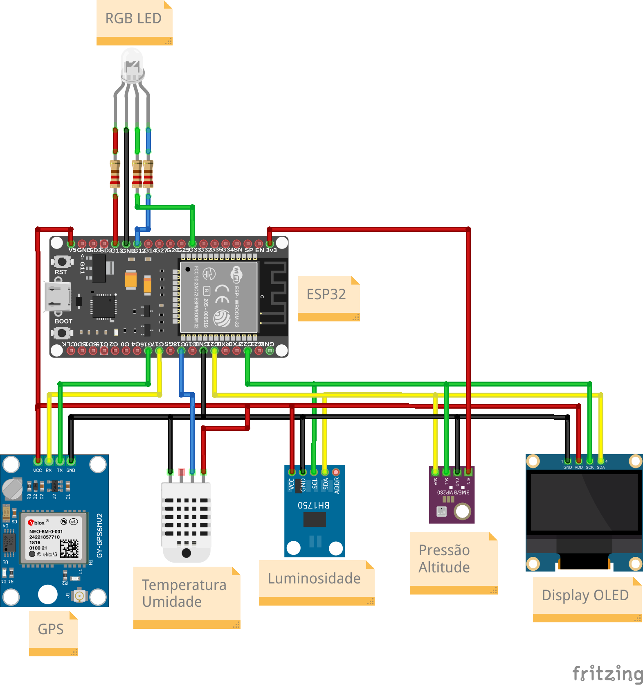

# Estação meteorológica portátil utilzando os módulos DHT22 (DHT11), BMP280, BH1750 e Display OLED

### Componentes
---

- `ESP32`: O microcontrolador que recebe os dados dos sensores.
- `LED RGB`:
    - `Branco`: Indica que o dispositivo está em processo de inicialização.
    - `Verde`: Indica que a coleta foi finalizada (Somente 1 piscada de 1 segundo).
    - `Azul` Indica que está em processo de coleta.
    - `Vermelho`: Indica que houve um erro no `BMP280`, `Display OLED`, `BH1750` ou falha no `GPS`.
- `Resistores de 220 Ohms`: Para diminuir um pouco a tensão dos `LEDs`, para não correr o risco de queimar os mesmos.
- `BMP280`: Responsável por medir a pressão e altitude do ambiente.
- `DHT22` ou `DHT11`: Responsável por medir a temperatura e umidade do ambiente.
- `GY-NEO6MV2`: Responsável por coletar os dados de geolocalização e velocidade.
- `BH1750`: Responsável pela coleta da luminosidade.
- `Display OLED`: Responsável pela parte visual do dispositivo.

### Bibliotecas Utilizadas
---

As bibliotecas de terceiros utilizadas para desenvolver esse projeto estão dentro da pasta `bibliotecas`, sendo elas:

- `Adafruit_BMP280`: Responsável pela coleta de dados barométricos (Pressão e altitude) do módulo `BMP280`.
- `DHT`: Responsável pela coleta de temperatura e umidade do módulo `DHT22` ou `DHT11`.
- `TinyGPSPlus`: Responsável pelo funcionamento do módulo de `GPS`.
- `BH1750`: Responsável pelo funcionamento do módulo de luminosidade (`BH1750`).
- `Adafruit_BusIO`, `Adafruit_GFX`, `Adafruit_SSD1306`: Responsáveis pelo funcionamento do `Display OLED`.

As demais bibliotecas utilizadas são bibliotecas disponibilizadas pela instalação padrão do `Arduino IDE` com importação dos pacotes do `ESP-32`.

### Esquemático do Projeto
---

Aqui encontra-se como o projeto foi e deve ser montado:

### Estrutura das Métricas
---

O sensor `BMP280` efetua a métrica da altitude em `Metros` e pressão em `Pascal (Pa)`.
O sensor `DHT11` ou `DHT22` efetua a métrica da temperatura em `ºC` e umidade em `%`.
O sensor `GY-NEO6MV2` coleta dados de latitude, longitude e velocidade em `km/h`.
O sensor `BH1750` coleta dados luminosidade em `lux`.
